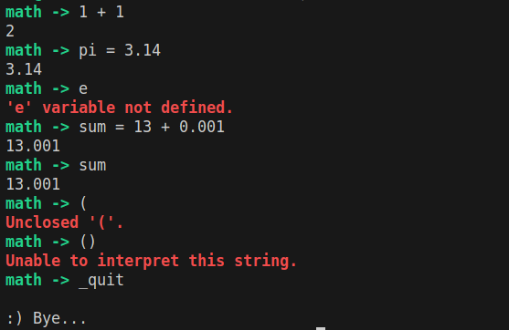

# Basic mathematical expression evaluator in C

This is a basic mathematical expression evaluator written in C. It supports the basic four operators (`+ -  / *`) and variables.

This is an excercise for myself about writing interpreters in C.

